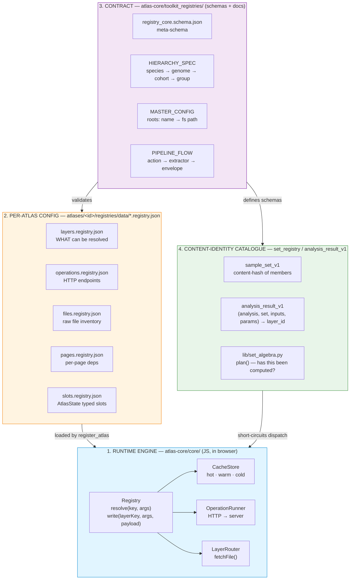
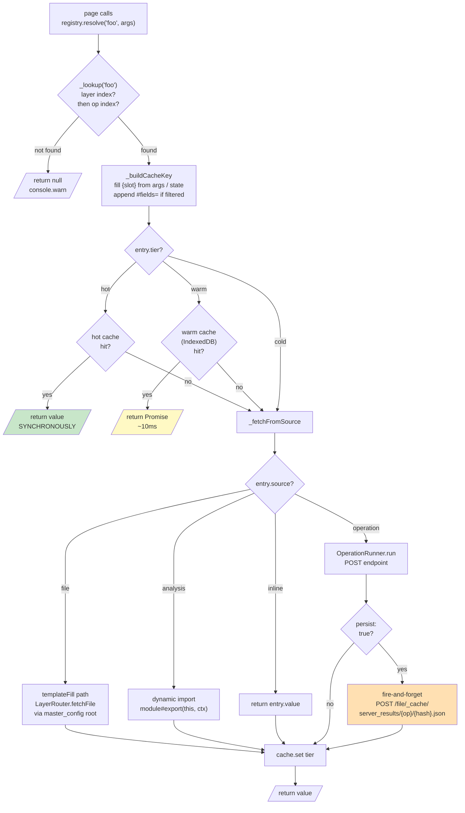
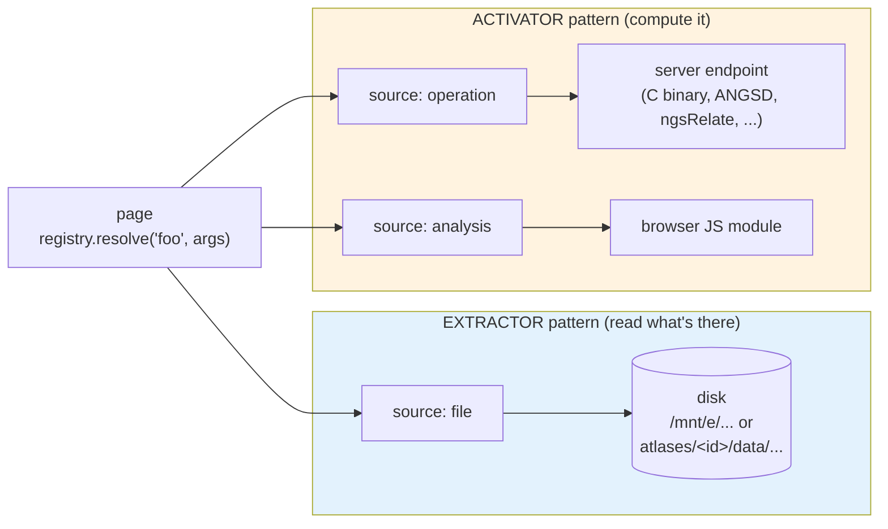
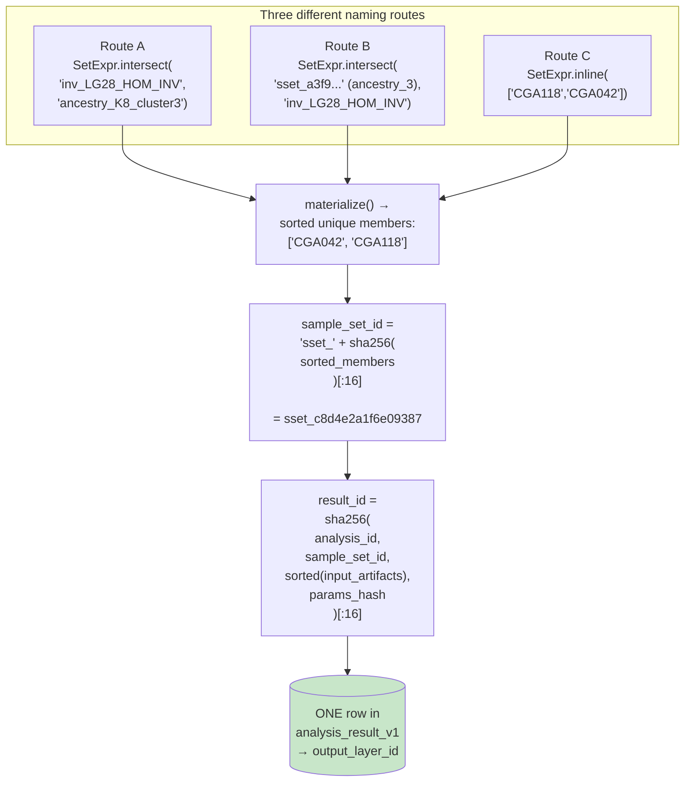
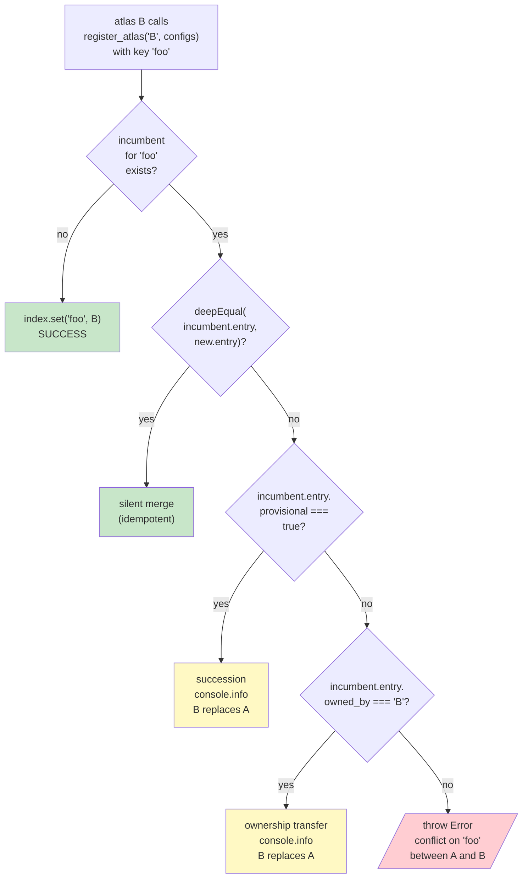

# Registry overview — visual companion

A diagram-first explanation of how the atlas data registry works.
Companion to the prose specs in [toolkit_registries/](toolkit_registries/).

---

## 1. The four layers, end to end

The "registry" is not one thing — it's a stack of four conceptually
distinct layers that share the same vocabulary.



Layers 1 + 2 are the live runtime path. Layers 3 + 4 are the
"do not let the cartesian explode" governance above them. The
engine is biology-blind — every atlas registers the same way.

---

## 2. What happens when a page calls `resolve('foo', args)`



**Hot-path rule:** hot-tier cache hits are the *only* synchronous
path. Everything else returns a Promise. Pages that read hot data
should ideally bypass `resolve()` and read `AtlasState` directly.

---

## 3. The five per-atlas registry files

Every atlas exposes its data through five JSON files in
`atlases/<id>/registries/data/`.

```
atlases/inversion/registries/data/
├── layers.registry.json         ← THE READ SURFACE
│   "scrubber_main": { tier: hot, source: file, path: "data/precomp/{chrom}.json", ... }
│
├── operations.registry.json     ← THE COMPUTE SURFACE (server)
│   "popstats_groupwise": { endpoint: "/api/popstats/groupwise", method: POST, cache_key: "...", ... }
│
├── files.registry.json          ← raw file inventory (paths, scope)
├── pages.registry.json          ← per-page requires_layers / requires_ops / preloads
└── slots.registry.json          ← typed AtlasState slots (default, persist, scope)
```

All five share one meta-schema —
[core/registry_core.schema.json](core/registry_core.schema.json) —
so the engine can validate any atlas's config at startup.

### A layer entry has four orthogonal axes

```
┌───────────────────────────────────────────────────────────────┐
│  layer_entry                                                  │
├───────────────────────────────────────────────────────────────┤
│                                                               │
│   source:      file | operation | analysis | inline           │
│   tier:        hot  | warm      | cold                        │
│   preload_on:  chrom_change | candidate_change | page_mount   │
│                | viewport_change | explicit                   │
│                                                               │
│   ─── source-specific ───                                     │
│   path:        "data/precomp/{chrom}.json"   (file)           │
│   operation:   "popstats_groupwise"          (operation)      │
│   analysis:    "analysis/x.js#runX"          (analysis)       │
│   value:       <inline literal>              (inline)         │
│                                                               │
│   ─── governance ───                                          │
│   writable, persist, cache_layout, schema, schema_status,     │
│   provisional, owned_by, fields, pin_to, chunked              │
│                                                               │
└───────────────────────────────────────────────────────────────┘
```

---

## 4. The two access patterns: extractor vs activator



| Question | Answer |
|---|---|
| Data already produced upstream (SLURM, manual)? | **extractor** (`source: file`) |
| Computation lives in a server C binary? | **activator** (`source: operation`) |
| Cheap JS calculation against resolved layers? | **activator** (`source: analysis`) |
| Want it persisted so next call skips work? | activator + `persist: true` |

---

## 5. The content-identity collapse — REGISTRY_LOOKUP rule

The problem: 50 named groups × 10 analyses × 30 intervals
= 100k+ entries before any real intersections.

The solution: three routes that produce the same sorted member
list collapse to **one** `sample_set_id` and **one** result row.



**Storage growth becomes proportional to *distinct computations
actually performed*, not to cartesian-product cells.** Tables that
stay small: `group_definition` (named, ~100s lifetime). Tables
that grow only with real work: `sample_set_v1`, `analysis_result_v1`.

The dispatcher inserts one `plan()` call between manifest
validation and runner dispatch — `status: "cached"` returns the
existing layer, `status: "todo"` triggers compute.

---

## 6. The action pipeline — capture first, normalize later

Every state-changing call goes through one envelope contract.
Pages **only ever consume `layer_envelope`s** — never raw TSV / RDS / Excel.

```mermaid
sequenceDiagram
  autonumber
  participant Page as Atlas page
  participant API as atlas_server<br/>FastAPI
  participant Disp as atlas dispatcher<br/>(per-atlas Python)
  participant Run as runner<br/>(C engine / Excel reader / ...)
  participant Ext as extractor<br/>(raw → payload)
  participant Reg as registry<br/>(layer envelopes)

  Page->>API: POST /api/actions<br/>{ action_id, type, dataset_id, target, params, expected_outputs }
  API->>API: validate against<br/>action_manifest.schema +<br/>schema_in/&lt;type&gt;.schema
  API->>API: append actions.log.jsonl<br/>(status=queued)
  API->>Disp: dispatch_action(manifest)

  Disp->>Disp: lib/set_algebra.plan()<br/>"do we already have this?"
  alt cache hit
    Disp-->>API: { layer_ids, cache_hit: true }
  else cache miss
    Disp->>Run: runner.run(manifest, members)
    Run-->>Disp: raw output (TSV / JSON / RDS)
    Disp->>Ext: extractor.parse(raw)
    Ext-->>Disp: typed payload
    Disp->>Disp: validate payload<br/>against schema_out/<br/>&lt;schema_version&gt;
    Disp->>Reg: write layer_envelope<br/>POST /file/layers/&lt;id&gt;.json
    Disp->>Reg: write analysis_result_v1 row
    Disp-->>API: { layer_ids, cache_hit: false }
  end

  API->>API: append actions.log.jsonl<br/>(status=success, produced_layers=[...])
  API-->>Page: 200 { layer_ids }
  Page->>Reg: GET /file/layers/&lt;id&gt;.json
  Reg-->>Page: rendered envelope
```

Only four new HTTP routes sit above the existing primitives:
`POST /api/actions`, `GET /api/actions/{id}`, `GET /api/layers`,
`GET /api/layers/{id}`. Everything else (popstats, ANGSD,
ancestry, LD) reuses what's already in `popstats_server.py`.

---

## 7. Multi-atlas conflict resolution

When two atlases register the same layer/op key:



This is what makes the "squatting" pattern safe.
`inversion-atlas` declares cohort-level layers today as
`provisional: true, owned_by: "population"`. The day
`population-atlas` registers the real ones, succession happens
silently with a `console.info`. No coordinated deploy needed.

---

## 8. The hierarchy the layer paths follow

```
SPECIES (taxonomic tag, ~5 ever)
   │  tagged on
   ▼
GENOME (one .fa file, 1-3 per species)
   │  FK genome_id
   ▼
COHORT (BAM list × genome × metadata) ◄── THE OPERATIONAL UNIT
   │
   ├── FK cohort_id ──► GROUP (analytical subset, append-only)
   ├── FK cohort_id ──► CANDIDATE
   ├── FK cohort_id ──► RESULT
   └── FK cohort_id ──► EVIDENCE
```

Reflected in the on-disk layout the layer paths point to:

```
data/
├── species/<species_id>.config.yaml
├── genomes/<genome_id>/
│   ├── precomp/                            ← genome_scoped roots
│   └── dosage/
├── cohorts/<cohort_id>/                    ← cohort_scoped roots
│   ├── cohort.config.yaml
│   ├── samples.tsv
│   ├── relatedness/<run_id>/
│   ├── ancestry/ngsadmix/K8/
│   ├── popstats/
│   ├── candidates/<candidate_id>/<version_id>/
│   └── groups/<group_id>.json
├── comparative/                            ← cross-species (NOT a cohort)
├── working_dir/
└── _cache/server_results/<op_id>/<hash>.json
```

**Combine rule:** two cohorts can be combined into one only if
`genome_id` matches AND `species_composition` matches. Both must
hold — same coordinates AND same biology.

---

## Where to read more

| Topic | File |
|---|---|
| The runtime engine, line by line | [core/registry_core.js](core/registry_core.js) |
| The five-file meta-schema | [core/registry_core.schema.json](core/registry_core.schema.json) |
| Hierarchy (species/genome/cohort/group) | [toolkit_registries/HIERARCHY_SPEC.md](toolkit_registries/HIERARCHY_SPEC.md) |
| Master config + roots | [toolkit_registries/MASTER_CONFIG.md](toolkit_registries/MASTER_CONFIG.md) |
| Extractor vs activator | [toolkit_registries/ACTIVATOR_EXTRACTOR.md](toolkit_registries/ACTIVATOR_EXTRACTOR.md) |
| Action / extractor / envelope pipeline | [toolkit_registries/PIPELINE_FLOW.md](toolkit_registries/PIPELINE_FLOW.md) |
| Content-identity / set algebra | [toolkit_registries/REGISTRY_LOOKUP.md](toolkit_registries/REGISTRY_LOOKUP.md) |
| set_v1 + analysis_v1 | [toolkit_registries/SETS_AND_ANALYSES.md](toolkit_registries/SETS_AND_ANALYSES.md) |
| Stdlib-Python parallel impl | [toolkit_registries/relatedness/README.md](toolkit_registries/relatedness/README.md) |
